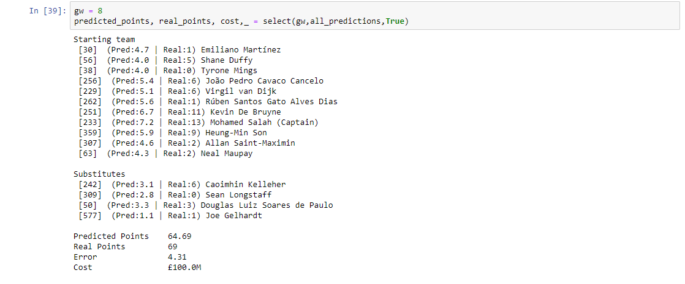
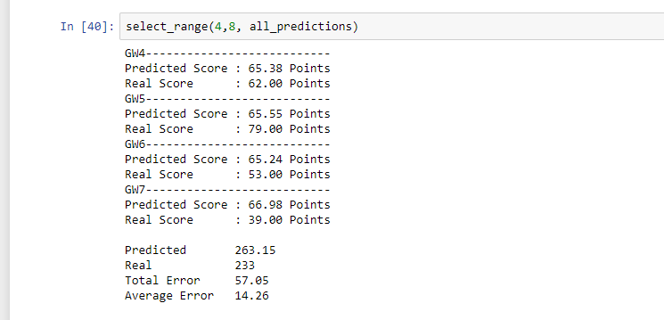

# Fantasy Dream Team Prediction using Regression and Optimal Search Algorithm
With over 8 million players, Fantasy Premier League is the biggest Fantasy Football game in the world. Every player is given 100 million to assemble a team of 11 starting players and 4 subsitutes. The selected teams have to constrain many team-related and formation-related restrictions.
In order to predict the possible points in a gameweek, LinearModel is utilized. The dream team with given constraints like not having more than 3 players from a team is produced using an optimization algorithm called Pulp. 

## Examples

